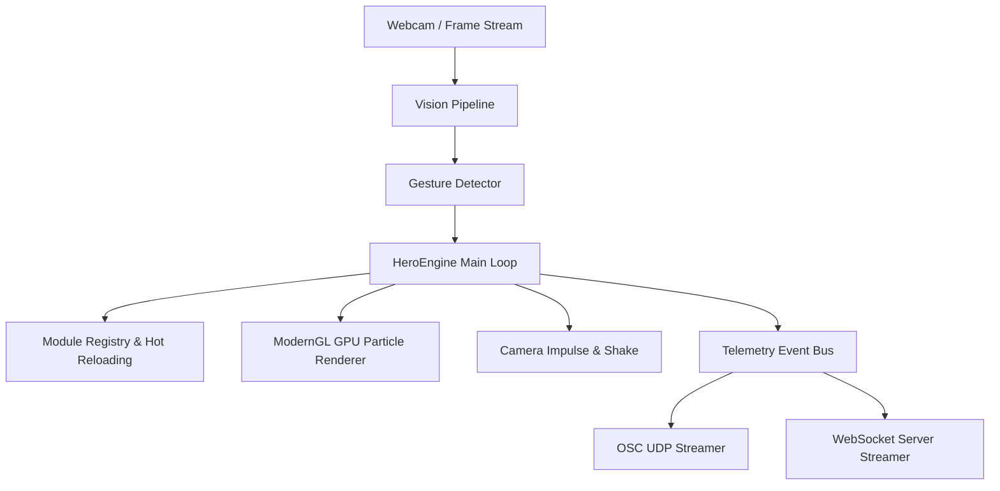

# HeroEngine Integration Guide

Welcome to the **HeroEngine Integration Guide**. This document provides an architectural reference for developers, module creators, system integrators, and performance engineers.

---

## 🏛️ System Architecture Overview

HeroEngine is a high-performance, real-time gesture-controlled particle visualization engine built with Python, ModernGL, OpenCV, and MediaPipe.



---

## 🔌 Custom Hero Module Development

Creating a new hero ability module is straightforward and decoupled from engine internals.

### 1. Module File Structure
Create a new directory under `src/modules/<your_module_id>/`:
```
src/modules/lightning/
├── manifest.json
├── module.py
└── shaders/
    └── custom_lightning.frag
```

### 2. Module Manifest (`manifest.json`)
```json
{
  "id": "lightning",
  "name": "Plasma Lightning",
  "version": "1.0.0",
  "author": "HeroEngine Developer",
  "description": "Procedural high-voltage lightning plasma generator",
  "entry": "module.py"
}
```

### 3. Hero Module Interface (`module.py`)
Each module implements `HeroModule`:
```python
from src.engine.core.module import HeroModule

class LightningModule(HeroModule):
    def initialize(self) -> None:
        # Module setup & resource allocation
        pass

    def update(self, dt: float, hands_data: list, gestures: dict) -> None:
        # Frame logic & particle request generation
        pass

    def render(self, renderer) -> None:
        # Submit GPU particle draw calls
        pass

    def cleanup(self) -> None:
        # Cleanup allocated resources
        pass
```

---

## 🌐 Real-Time Telemetry Network Streaming

HeroEngine streams real-time hand coordinates, active module states, and frame metrics via decoupled network transports.

### 1. OSC Transport (UDP)
* **Port:** `9000` (Default, configurable in `config/default.yaml`)
* **Address Pattern:** `/heroengine/telemetry`
* **Type Tag:** `s` (Serialized binary packet)

### 2. WebSocket Transport (TCP JSON)
* **Port:** `8765`
* **JSON Schema Format:**
```json
{
  "timestamp": 1721557000.123,
  "frame_number": 1420,
  "hands": [
    {
      "hand_id": "right",
      "gesture": "PINCH",
      "confidence": 0.99,
      "position": [0.45, 0.52, -0.1],
      "pinch_distance": 0.012,
      "grab_strength": 0.0
    }
  ],
  "active_module": "thunder",
  "camera_offset": [0.0, 0.0, 0.0],
  "fps": 60.0
}
```

---

## ⚙️ Configuration Reference (`config/default.yaml`)

```yaml
engine:
  window_title: "HeroEngine v1.0"
  width: 1280
  height: 720
  vsync: true
  target_fps: 60

network:
  enabled: true
  osc_host: "127.0.0.1"
  osc_port: 9000
  websocket_port: 8765

modules:
  default: "iron"
  discovery_dir: "src/modules"
```

---

## 📦 Standalone Packaging Workflow

To package HeroEngine into a standalone executable bundle (`dist/HeroEngine/`):

```powershell
# Clean build
.\venv\Scripts\python scripts/build_app.py --clean --release
```
The build pipeline generates build metadata (`build_info.json`) and verifies all shader and module dependencies automatically.
